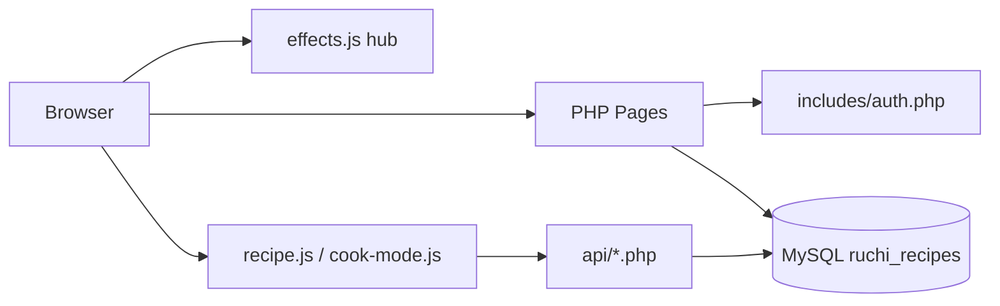

# Ruchi — Malaysian Traditional Recipes (PHP + MySQL)

High-level Malaysian client recipe platform for XAMPP. Built from the Ruchi product brief: recipe detail with serving adjuster, Cook Mode, nutrition, comments, cookbook, shopping list, author dashboard, and admin moderation.

## Stack

- PHP 8+ (XAMPP)
- MySQL / MariaDB
- Vanilla JS effects hub (`assets/js/effects.js`) — toggleable / updateable at runtime
- CSS design system (Malaysia-inspired green + turmeric accent)

## Setup (XAMPP)

1. Start **Apache** and **MySQL** in XAMPP.
2. Open phpMyAdmin → Import in order:
   - `database/schema.sql`
   - `database/seed.sql`
3. Confirm DB credentials in `config/database.php` (default XAMPP: user `root`, empty password).
4. Open: [http://localhost/receipe/](http://localhost/receipe/)

If your folder name differs, update `APP_URL` in `config/app.php`.

## Demo logins

All passwords: `password123`

| Email | Role |
|---|---|
| admin@ruchi.my | Admin |
| siti@ruchi.my | Author (verified) |
| chen@ruchi.my | Author |
| priya@ruchi.my | Author |
| aiman@ruchi.my | User |

## Seed recipes

**Malaysian:** Nasi Lemak, Beef Rendang, Penang Char Kway Teow, Roti Canai + Dhal, Nyonya Laksa Lemak, Kuih Seri Muka.

**Traditional Indian (millet / onion / Kanchipuram):** Chinna Vengaya Sambar, Vengaya Thuvayal, Ragi Kali, Kambu Koozh, Thinai Sakkarai Pongal, Samai Vegetable Upma, Kanchipuram Idli.

Extra SQL: `database/seed_indian.sql` (already importable on top of schema + seed).

## Admin publish workflow

1. Author submits via `/submit.php` → status `SUBMITTED` (never auto-live).
2. Admin opens **Review queue** → **Complete & publish**.
3. Admin enters full ingredients, preparation steps, nutrition (per serving), and short mp4 video.
4. Publish requires: ingredients, ≥2 steps, nutrition calories, and video URL.
5. Public recipe page shows the small cooking clip (autoplay muted on scroll).

## Updatable JS effects

Edit toggles in `includes/footer.php`:

```js
window.RUCHI.effects = {
  scrollReveal: true,
  hoverLift: true,
  stickyPanel: true,
  parallaxHero: true,
  toasts: true
};
```

Or at runtime in the browser console:

```js
RuchiEffects.update({ parallaxHero: false, scrollReveal: true });
```

Page-specific scripts:

- `assets/js/recipe.js` — servings math, step timers, like/save/cooked
- `assets/js/cook-mode.js` — full-screen steps, swipe, progress bar, wake lock

## Key pages

| URL | Purpose |
|---|---|
| `/` | Home hero + cuisines + trending |
| `/browse.php` | Filters (cuisine, veg/non-veg/vegan, meal, difficulty) |
| `/recipe.php?slug=...` | Flagship detail page |
| `/cook.php?slug=...` | Distraction-free Cook Mode |
| `/cuisine.php?slug=malay` | Cuisine landing |
| `/account/` | Cookbook, shopping list, cooking log |
| `/author-dashboard/` | Author performance |
| `/admin/` | Review queue + cuisines |

## Architecture



## Business rules implemented

- Only `PUBLISHED` recipes are public
- Verified authors auto-publish; others go to `SUBMITTED` review queue
- Serving adjuster recalculates display quantities client-side only
- `cooked_count` increments once per user per recipe (idempotent)
- Veg / Non-Veg / Vegan / Eggetarian filterable on browse
- Schema.org Recipe JSON-LD on recipe pages
